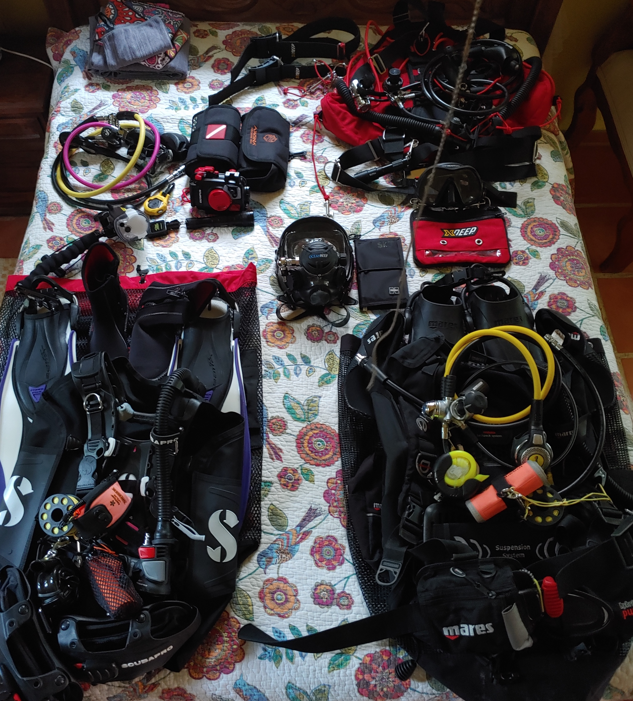

Diving is something I have wanted to try off and on since I was young, unfortunately
it never seemed to be the right time. In 2014 on honeymoon I got the chance to do a 
guided dive in Bora Bora and was hooked, I loved it. It still took a year and a half 
to get myself enrolled in a class in Seattle and get certified.

I have been seriously diving now since February 2016, and convinced my wife to start in 
March. We have both certified to advanced open water and love to be in the water as much 
as we can. Although I would prefer warm water there is a pleasure in diving locally even 
if it masochistic -- dry suits are a pain!. We had the great pleasure of a wonderful
trip to Bonaire and spent a week aboard the [Bonaire from the sea](http://bonairefromthesea.org/index.html) 
AMORAY with Sue, Richard, and Rob. The diving was great, as well as finishing our
advanced certification we also complete the wreck certification on the
[Hilma Hooker](https://en.wikipedia.org/wiki/Hilma_Hooker).

I have slowly worked up to an expensive camera setup as I found that the GoPro I was
using (HERO6, with Super Suit housing and filters) was fun as a record of the dive
and the 4K video it took could be truly spectacular, but... when people asked what we 
saw they expected pictures not hours of video. I started taking stills from the video
but they were never quite as clear as I hoped and so I skipped the smaller dive
cameras and decided to build myself a nice rig. A shout out to 
[Annie Crawley](https://www.anniecrawley.com/) who runs a really good underwater 
photography course, thanks!

I do try and remember to upload dives to [Dive Logs](https://en.divelogs.de/profile/johnstonskj)
but it's not always as up to date as it should be. I use [DiveLogDT](http://www.moremobilesoftware.com/DiveLogDT/)
as my primary log, syncing from my Atomic Aquatics [Cobalt II](https://www.atomicaquatics.com/computer.html) 
computer.

  

## Photos

In our happy place, Isla Mujeres MX.

Although, cenotes with francisco (at [Dive Life](http://divelife.mx/en/) Playa del Carmen)
comes a pretty close second.

We also dive in the cold, a lot more work but it can be really rewarding. In 2019 we 
took part in a community clean-up dive as part of Earth Day under the docks at the 
Kirkland, WA waterfront.

Apparently at some point I took a rest...

## Places Dived So Far

* US
  * Seattle, Kirkland
  * La Jolla, CA
  * Key West and Key Largo, FL
* Caribbean
  * Isla Mujeres, Cozumel, Playa del Carmen, and Mahahual MX
  * Grand Turk and St Kitts
  * Bonaire
* Asia
  * Indonesia Derawan Islands
* South Pacific
  * Bora Bora

## Gear

The following picture was our August 2020 trip to Mexico, three sets of gear for two people. We still haven't mastered
the ability to pack light.

* Backmount
  * [Mares](https://www.mares.com/us-US/home/) Pure Hybrid BC
  * Mares Abyss II Navy regulator
  * [Ocean Reef](https://diving.oceanreefgroup.com/) full-face mask with [Shearwater](https://www.shearwater.com/products/) Nerd2 AI
  * Mares Quattro+ _or_ Mares X-Stream fins
* Sidemount
  * [xDeep](https://www.xdeep.eu/) Stealth 2.0 Tec RB
  * Pair [Hollis](https://www.hollis.com/) DC1/212 regulators
  * [Atomic Aquatics](https://www.atomicaquatics.com/) venom mask
  * Shearwater Perdix
* Cold Water
  * [Waterproof](http://waterproof-usa.com/) Hybrid D1 drysuit
  * Waterproof hood and gloves
  * [XS Scuba](https://www.xsscuba.com/fins) Turtle fins
* [Dive Rite](https://www.diverite.com/product-categories/lights/) HP50 primary light _and_ Big Blue AL1100NP backup light
* Mares Smart backup computer
* Camera
  * [Sony](https://www.sony.com/electronics/interchangeable-lens-camera-products/t/interchangeable-lens-cameras) a7RIII
  * Sony FE 28mm f/2-22 with either Sony 21mm f/2.8-22 Ultra Wide Converter _or_ Sony 16mm f/3.5-22 Fisheye Converter
  * Sony FE 90mm F/2.8 Macro G OSS
* [Ikelite](https://www.ikelite.com/) Housing with either 8" dome port _or_ flat macro port
* Pair Ikelite DS-160 Strobes with dome diffusers
* [Big Blue](https://bigbluedivelights.com/) VL7200P-TC-18 primary _and_ VL3500P secondary/focus lights
* [Kraken](https://krakensports.ca/product-category/photography-lighting/)/Weefine 3000 macro ring light

## Certifications

* Open Water (Seattle)
* Dry Suit (Seattle)
* Advanced Open Water (Seattle, Bonaire)
* Nitrox (Bonaire)
* Wreck (Bonaire)
* Full-face mask (Bonaire)

