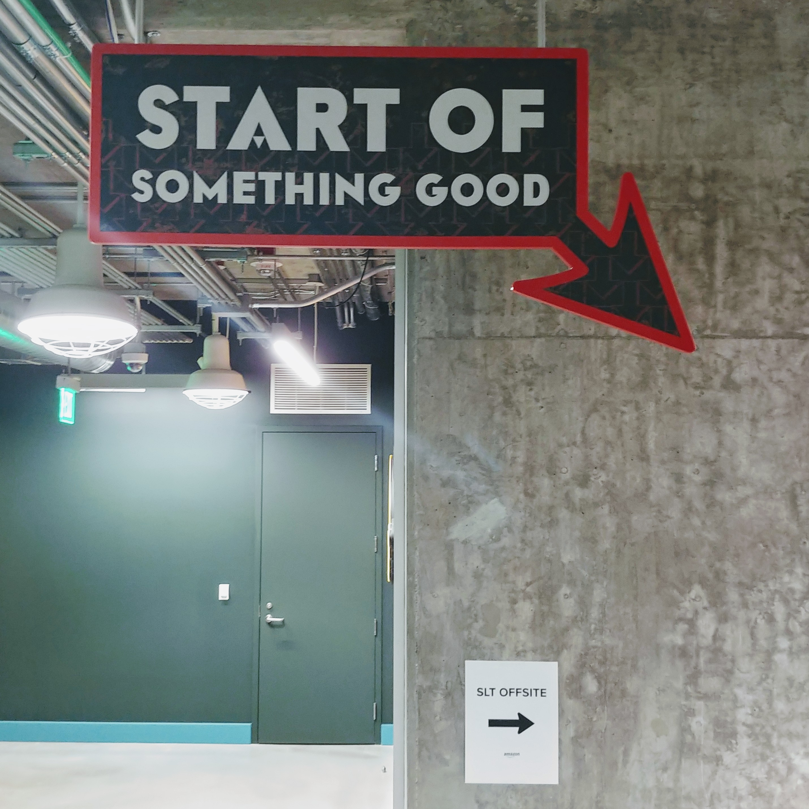
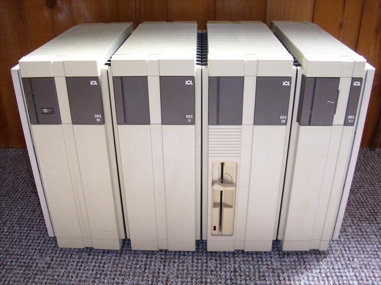

I am a software geek, starting at high school with an accidental fall into computer science. 
Programming in school was in [BBC BASIC](https://en.wikipedia.org/wiki/BBC_BASIC), although
at home I used [Turbo Pascal](https://en.wikipedia.org/wiki/Turbo_Pascal) as well as some
[6502](https://en.wikipedia.org/wiki/MOS_Technology_6502). It turned out I didn't entirely
suck at it so I decided to stick with it. At college (6th form, or ages 17-18 for the 
non-British reader) we had a teacher that decided we should learn something we could 
actually get paid for which meant [COBOL](https://en.wikipedia.org/wiki/COBOL) running
on a Digitial Equipment Corp (DEC) micro-[VAX](https://en.wikipedia.org/wiki/VAX).

During the same time I got a summer and weekend job and when the IT manager learned I
was not only studying CS but also learning COBOL he let me loose on their ageing
[Burroughs](https://en.wikipedia.org/wiki/Burroughs_Corporation) mainframe; so I
can say with only minor truth-stretching that I have been paid to write COBOL. The
company moved from this old system slowly to a _departmental mini-computer_ based
on the [Pick](https://en.wikipedia.org/wiki/Pick_operating_system) operating system
which was a strange experience (don't recall the computer make though). 

University continued the VAX experience but with the addition of a new language, 
[Ada](https://en.wikipedia.org/wiki/Ada_(programming_language)), which I still like
even though it really isn't fashionable to say so out loud.

My first full-time job was with the now defunct
[ICL](https://en.wikipedia.org/wiki/International_Computers_Limited) Retail Systems
(when looking for something from the ICL days I found [this](_posts/2019-06-13-ICL-EMail-Signature.md) embarressment).
Mostly this was C and C++ ([Glockenspiel](http://www.edm2.com/index.php/Glockenspiel_C%2B%2B)
and [Zortec](http://www.edm2.com/index.php/Zortech_C%2B%2B) on 
[OS/2](https://en.wikipedia.org/wiki/OS/2)) although some tools were written in
[Modula-2](http://www.edm2.com/index.php/TopSpeed_Modula-2) with some 
experimental [Modula-3](http://modula3.org/) usage. This was a great 6 years, I learned 
so much not just as a professional programmer but also about how to work in teams
and the fact that there are always people smarter than you to learn from and 
so much to learn.

Having moved to the US in 1998 for a brief stint at Microsoft I joined 
[Rational Software](https://en.wikipedia.org/wiki/Rational_Software) in Redmond WA.
After Rational's aquisition by [IBM](www.ibm.com) I lived in North Carolina for a period
where I worked on a number of developer tools efforts as well as standards. I was
active in the architecture of the very cool [jazz](https://jazz.net/) project, which led to
the formation of the [Open Services for Lifecycle Collaboration](https://open-services.net/)
group. I was also a member of the IBM Software Group Architecture Board which was
a lot of fun with some really super-smart people!

I have been at Amazon now since 2009 and currently I am a Senior Principal 
Engineer in the consumer side with particular focus on 
[Amazon Fashion](https://www.amazon.com/amazon-fashion/b?node=7141123011). 

I have
also worked on various parts of the back-end of the retail web site as well as the
migration of Amazon Fresh into the amazon.com site. 

## Not-a-Resume

I don't have one online, but between my [LinkedIn](https://www.linkedin.com/in/simonkjohnston/)
profile and [Google Scholar](https://scholar.google.com/citations?user=oXcWSwYAAAAJ&hl=en)
page that should cover things pretty well.

## Standards Involvement

There's some old Point of Sale (PoS) device standards work, but it's hard to even 
find references to that work online now. Here's what does remain.

* Object Management Group (OMG)
  * [UML](http://uml.org/)
  * [BPMN](http://www.bpmn.org/)
  * [OCL](https://www.omg.org/spec/OCL/About-OCL/) 
* World Wide Web Consortium (W3C)
  * [XML Schema WG](https://www.w3.org/XML/Schema) 
  * [SPARQL WG](https://www.w3.org/2009/sparql/wiki/Main_Page) update specification
* RosettaNet (now at [GS1](https://resources.gs1us.org/rosettanet))
* Collaborate Planning, Forecasting, and Replenishment (CPFR)

## Footnotes

ICL was a really fun place to work at that time, their [VME](https://en.wikipedia.org/wiki/ICL_VME)
systems were doing well, they had a range of Unix systems and a big commitment to open
systems. However, they never saw an engineering problem they couldn't develop an 
expensive and over-engineered solution for! My personal favorite was the 
[DRS 300](https://en.wikipedia.org/wiki/ICL_DRS#DRS_300), a machine that came in modules, 
each one in a solid chassis that you could use as a step-stool, you strung them together
using SCSI cables (even though none of the inner components were ever actually SCSI. They
clipped together side by side and you put a blanking plate on each end.

The result was people with 5' of these damn things across the top of book cases and
honestly it ran a version of SVR4 sucky slow.
